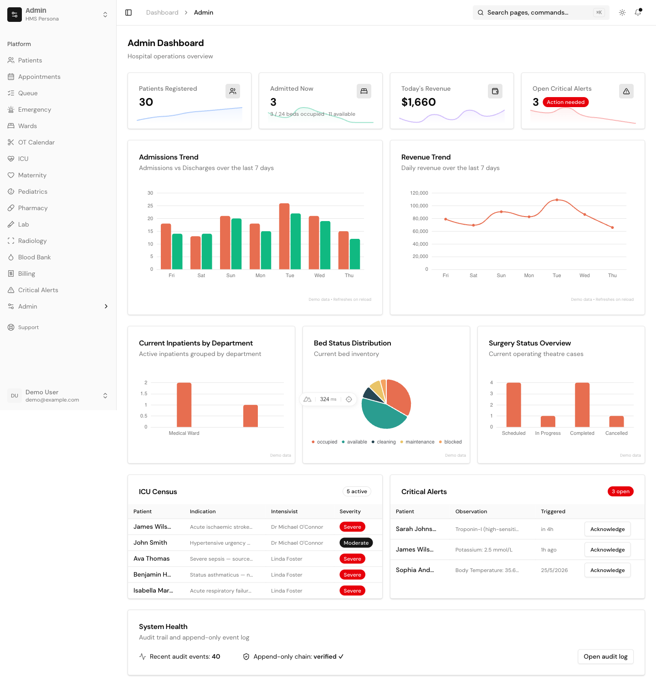
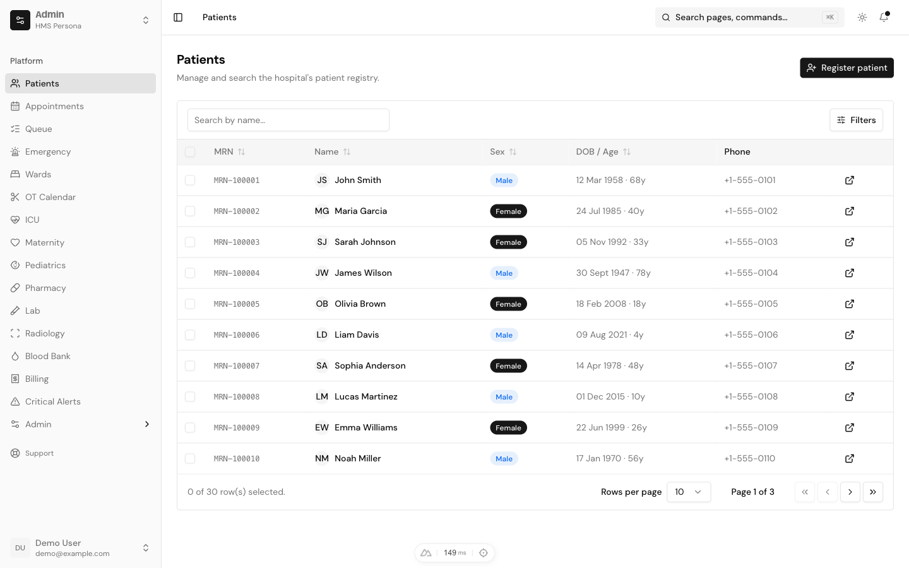
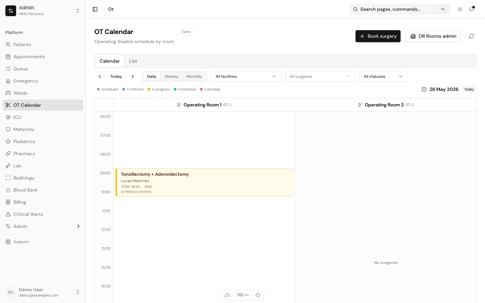

# uipkge HMS

A reference **HMS** (Hospital Management System) template built end-to-end on the
[uipkge](https://uipkge.dev) UI registry. Every clinical and administrative workflow —
OPD, IPD, ER, OT, ICU, maternity, pharmacy, lab, radiology, blood bank, billing — is
implemented as a polished, realistic page you can copy-paste into a real hospital app.

The **frontend runs entirely on in-memory mock data** (no setup required), while a full
**Nuxt server layer** (Nitro API routes, Drizzle ORM, session auth, billing, email,
i18n, structured logging) ships alongside it — every integration env-gated so a fresh
`git clone` boots with zero configuration and you wire up real services only when you
need them.

**Live demo:** [hospital-management-two-sand.vercel.app](https://hospital-management-two-sand.vercel.app) — no signup; click **"Continue as demo user"**, then use the persona switcher to tour each role.



<details>
<summary><b>More screenshots</b></summary>

### Patient directory



### OT calendar



</details>

- **Framework:** Nuxt 4 + Vue 3 (Composition API, `<script setup>`)
- **UI:** shadcn-vue primitives from the `@uipkge` registry, on Reka UI
- **Styling:** Tailwind v4 with OKLCH design tokens
- **Charts:** ECharts via `vue-echarts`
- **Tables:** TanStack Table (`@tanstack/vue-table`)
- **State:** `useState` + composables (mock-data store; no Pinia)
- **Backend (optional, env-gated):** Nitro + Drizzle (postgres-js) + `nuxt-auth-utils` + Polar + Resend

---

## Quick start

```bash
git clone https://github.com/uday-a/uipkge-hms-nuxt-template my-hms
cd my-hms
npm install
npm run dev        # http://localhost:3500
```

Open <http://localhost:3500>, click **"Continue as demo user"** (demo mode auto-activates
in dev), then use the **persona switcher** at the top of the sidebar to tour every role.
No environment variables are required to start — the app runs on mock data.

| Script                | What it does                                    |
| --------------------- | ----------------------------------------------- |
| `npm run dev`         | Dev server on port **3500**                     |
| `npm run build`       | Nitro production build (`.output/`)             |
| `npm run preview`     | Preview the production build locally            |
| `npm run generate`    | Static prerender                                |
| `npm run lint`        | ESLint (flat config via `@nuxt/eslint`)         |
| `npm run typecheck`   | `vue-tsc` type-check                            |
| `npm run knip`        | Unused files / exports / deps                   |
| `npm run duplicates`  | `jscpd` copy-paste detection                    |

---

## Personas

The sidebar's switcher is a **persona switcher** — the demo's main interactive variable.
Each persona has its own dashboard, sidebar nav, and default route. The selection
persists to `localStorage`.

| Persona          | Default route             | What they do                                                         |
| ---------------- | ------------------------- | -------------------------------------------------------------------- |
| **Admin**        | `/dashboard/admin`        | Facility KPIs, ward/ICU census, OT board, audit log, system health   |
| **Doctor**       | `/dashboard/doctor`       | Patient queue, encounters, orders, critical results                  |
| **Nurse**        | `/dashboard/nurse`        | Ward roster, MAR, nursing chart, vitals, ER triage                   |
| **Pharmacist**   | `/dashboard/pharmacist`   | Dispense queue, drug batches, inventory                              |
| **Lab Tech**     | `/dashboard/lab`          | Lab worklist, results entry, signed reports, critical values         |
| **Radiologist**  | `/dashboard/radiology`    | Studies awaiting report, signed radiology reports                    |
| **Receptionist** | `/dashboard/reception`    | Appointments, register/admit patient, ER walk-ins, billing           |

---

## Modules

Clinical and administrative workflows, each backed by realistic mock data:

| Area            | Routes                                                                                  |
| --------------- | --------------------------------------------------------------------------------------- |
| **Patients**    | `/patients`, `/patients/[id]`, `/patients/new`                                          |
| **Front desk**  | `/appointments`, `/queue`, `/admissions`, `/discharge/[encounterId]`                    |
| **Encounters**  | `/encounters`, `/encounters/[id]`, `/prescriptions`                                     |
| **Emergency**   | `/er`, `/er/new`, `/er/[id]`, `/alerts/critical`                                         |
| **Wards / IPD** | `/wards`, `/wards/[unitId]`, `/nursing-chart`, `/mar`                                    |
| **OT**          | `/ot`, `/ot/schedule`, `/ot/bookings`, `/ot/bookings/[id]/checklist`, `/pac`, `/anesthesia` |
| **ICU**         | `/icu`, `/icu/admit`, `/icu/[admissionId]`                                               |
| **Maternity**   | `/maternity`, `/maternity/anc`, `/maternity/labour`, `/maternity/delivery`              |
| **Pediatrics**  | `/pediatrics`, `/pediatrics/[patientId]`                                                 |
| **Pharmacy**    | `/pharmacy/queue`, `/inventory`, `/inventory/grn`, `/inventory/transfers`               |
| **Lab**         | `/lab/worklist`, `/lab/orders`, `/lab/reports`                                           |
| **Radiology**   | `/radiology/worklist`, `/radiology/orders`, `/radiology/reports`                        |
| **Blood bank**  | `/blood-bank`, `/blood-bank/donors`, `/blood-bank/requests`                             |
| **Billing**     | `/billing`, `/billing/[id]`                                                              |
| **Admin**       | `/admin/services`, `/admin/drugs`, `/admin/lab-catalog`, `/admin/or-rooms`, `/admin/schedules`, `/admin/wards`, `/admin/audit` |
| **Settings**    | `/settings/*` (account, general, security, notifications, integrations, billing, team)  |
| **Auth**        | `/login`, `/sign-up`, `/forgot-password`, `/mfa`, `/invite/[token]`                      |

### Cross-cutting UX

- **Command palette** — global search across pages (⌘K / `Ctrl+K`).
- **Theme** — light / dark / system, persisted to a cookie (no FOUC; toggled before paint).
- **Charts** — ECharts dashboards (KPI sparklines, trend bars, distribution pies).
- **Tables** — TanStack data tables with sorting, filtering, and pagination.

---

## Project structure

```
app/
├── components/
│   ├── ui/            # shadcn-vue primitives from the @uipkge registry
│   ├── blocks/        # composed sections (auth forms, dashboard layout, sidebar, marketing)
│   └── kanban/        # kanban pieces
├── composables/
│   ├── useMockState.ts  # reactive in-memory HMS store (the data source for every page)
│   ├── usePersona.ts    # persona switcher + per-persona sidebar nav
│   ├── useTheme.ts      # cookie-backed theme (light/dark/system)
│   └── useMonthGrid.ts  # calendar grid helper (OT scheduler)
├── layouts/
│   └── dashboard.vue    # app shell — header + persona sidebar + breadcrumbs
├── middleware/
│   └── auth.ts          # page-level auth gate (opt in via definePageMeta)
├── mocks/               # 30+ static seed files (patients, encounters, orders, OT, ICU, …)
│   ├── types.ts         # all TypeScript interfaces
│   └── index.ts         # barrel re-export
└── pages/               # file-based routes (see Modules above)

server/
├── api/                 # Nitro routes (admin, billing, drugs, services, schedules, webhooks, …)
├── db/                  # Drizzle schema + lazy postgres-js singleton + migrations
├── plugins/             # theme FOUC script, logger flush
└── utils/               # apiHandler envelope, guards, mailer, polar, logger, zod env
```

---

## Mock data layer

The clinical UI is driven entirely by `app/mocks/`. The `useMockState()` composable wraps
it in a `reactive()` singleton — mutations survive navigation within a session.

```ts
const state = useMockState()

// Read
const openAlerts = state.criticalAlerts.filter(a => !a.acknowledgedAt)

// Mutate (reactive — the UI updates immediately)
const alert = state.criticalAlerts.find(a => a.id === 'alert-001')
if (alert) {
  alert.acknowledgedAt = new Date().toISOString()
  alert.acknowledgedByUserId = 101
}
```

To wire a page to a real backend, swap `useMockState()` reads for `useFetch('/api/…')`
and implement the matching Nitro route under `server/api/`.

---

## Backend (optional, env-gated)

A full server layer ships with the template. Every external integration is **optional**
and degrades gracefully — unset its env var and that feature no-ops; set it and it turns on.
Partial configuration fails loud at boot (zod-validated `server/utils/env.ts`).

| Capability        | Env var(s)                                           | Unset behavior                          |
| ----------------- | ---------------------------------------------------- | --------------------------------------- |
| Sessions          | `NUXT_SESSION_PASSWORD` (required, 32+ chars)        | Boot fails — generate one to start auth |
| GitHub OAuth      | `NUXT_OAUTH_GITHUB_CLIENT_ID` / `_SECRET`            | Demo mode auto-activates in dev         |
| Database          | `DATABASE_URL` (Postgres via Drizzle)                | Auth skips DB upsert; `useDb()` throws  |
| Billing           | `POLAR_ACCESS_TOKEN` / `POLAR_WEBHOOK_SECRET`        | Billing endpoints return a hint         |
| Email             | `RESEND_API_KEY` / `EMAIL_FROM`                      | Emails print to the console             |
| i18n CDN          | `I18NOW_PROJECT_ID`                                  | Local `i18n/locales/*.json` only        |
| Observability     | `AXIOM_TOKEN` / `NUXT_PUBLIC_SENTRY_DSN` / `NUXT_PUBLIC_POSTHOG_KEY` | Logger prints locally; SDKs not loaded |

See `.env.example` for the full list. Every `server/api/**` handler returns the standard
`{ ok, data }` / `{ ok, error }` envelope (`server/utils/response.ts`).

---

## Deployment

```bash
npm run build        # Nitro production build → .output/
npm run preview      # preview locally
```

Deploy anywhere Nitro runs: Vercel, Cloudflare, Netlify, or bare Node.

---

## Adding a UI component

```bash
npx shadcn-vue add @uipkge/<name>
```

Components land in `app/components/ui/<name>/`. The `@uipkge` registry is configured in
`components.json`. Browse the full catalog at [uipkge.dev](https://uipkge.dev).

---

## License

MIT — see [LICENSE](./LICENSE).

---

## Credits

- [Nuxt](https://nuxt.com) for the framework
- [shadcn-vue](https://www.shadcn-vue.com) + [uipkge](https://uipkge.dev) for the component system
- [Reka UI](https://reka-ui.com) for headless primitives
- [Lucide](https://lucide.dev) for icons
